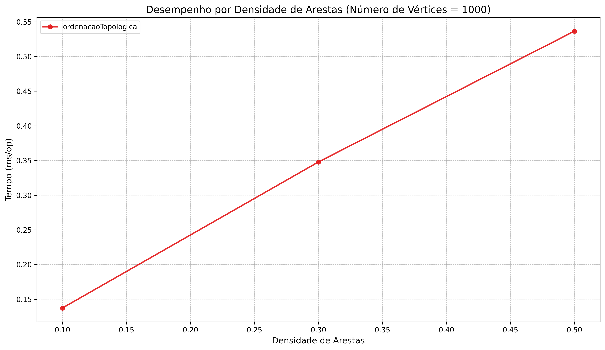
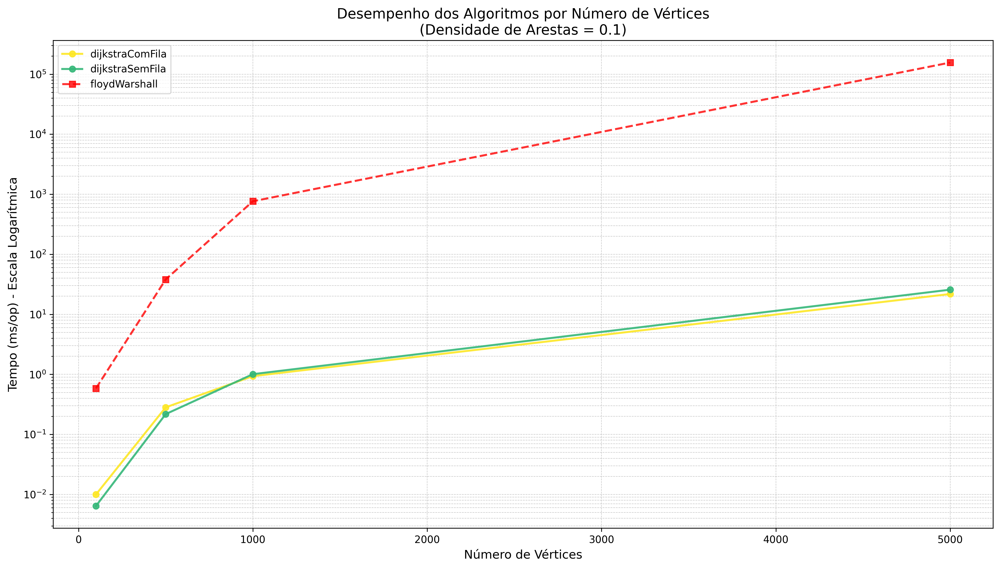

# Análise Comparativa de Algoritmos em Grafos

Este projeto contém implementações de cinco algoritmos de grafos e um sistema integrado para benchmarking e visualização dos resultados.

## Índice
- [Análise Comparativa de Algoritmos em Grafos](#análise-comparativa-de-algoritmos-em-grafos)
  - [Índice](#índice)
  - [Algoritmos Implementados](#algoritmos-implementados)
  - [Configuração Inicial](#configuração-inicial)
    - [Requisitos de Sistema](#requisitos-de-sistema)
    - [Clonando o Repositório](#clonando-o-repositório)
  - [Executando Testes](#executando-testes)
    - [Executar todos os testes](#executar-todos-os-testes)
    - [Executar testes de uma classe específica](#executar-testes-de-uma-classe-específica)
  - [Executando Benchmarks](#executando-benchmarks)
    - [Visualização dos Resultados](#visualização-dos-resultados)
  - [Visualização dos Resultados](#visualização-dos-resultados-1)
    - [Arquivos Gerados](#arquivos-gerados)
  - [Análises Detalhadas dos Algoritmos](#análises-detalhadas-dos-algoritmos)
    - [1. Ordenação Topológica (DFS)](#1-ordenação-topológica-dfs)
      - [Complexidade Teórica](#complexidade-teórica)
      - [Aplicações Práticas](#aplicações-práticas)
      - [Resultados dos Benchmarks](#resultados-dos-benchmarks)
      - [Análise Visual de Performance](#análise-visual-de-performance)
    - [2. Algoritmo de Dijkstra e Floyd-Warshall](#2-algoritmo-de-dijkstra-e-floyd-warshall)
    - [3. Algoritmo de Disjoint Set Union (DSU)](#3-algoritmo-de-disjoint-set-union-dsu)
    - [4. Algoritmo de Busca em Largura (BFS)](#4-algoritmo-de-busca-em-largura-bfs)
  - [Licença](#licença)
  - [Autores](#autores)

## Algoritmos Implementados

- **Ordenação Topológica (DFS)**: Ordena vértices em grafo direcionado acíclico
- **Dijkstra**: Menor caminho de origem única  
- **Union-Find (DSU)**: Operações de união e busca
- **Floyd-Warshall**: Menor caminho entre todos os pares
- **BFS**: Busca em largura

```bash
.
├── src/
│   ├── main/java/        # Implementações dos algoritmos
│   ├── test/java/        # Testes unitários
│   └── jmh/java/         # Benchmarks JMH
├── documentation/        # Documentação detalhada de cada algoritmo
├── run_benchmark.sh      # Script unificado para todos os benchmarks
└── gerar_grafico         # Adição de algoritmos para geração de gráficos
```

## Configuração Inicial

### Requisitos de Sistema
- JDK 11 ou superior
- Gradle 7.0+ (ou use o wrapper incluído: `./gradlew`)
- Git
- Matplotlib

### Clonando o Repositório
```bash
git clone https://github.com/joycevnr/AlgorithmsInvolvingGraphs.git
cd AlgorithmsInvolvingGraphs
```

## Executando Testes

### Executar todos os testes
```bash
./gradlew test
```

### Executar testes de uma classe específica
```bash
./gradlew test --tests "br.ufcg.computacao.toposort.OrdenacaoTopologicaTest"
```

## Executando Benchmarks

**Tornar o arquivo executável:**
```bash
chmod +x run_benchmark.sh
```

**Algoritmos:**
```bash
./run_benchmark.sh --toposort         # Ordenação Topológica
./run_benchmark.sh --bfs              # Busca em Largura (BFS)
./run_benchmark.sh --dsu              # Union-Find (DSU)
./run_benchmark.sh --menorcaminho     # Menor Caminho: Dijkstra e Floyd-Warshall

# Modo rápido (menos iterações)
./run_benchmark.sh --toposort --quick

# Ver ajuda
./run_benchmark.sh --help
```

### Visualização dos Resultados

Após executar o benchmark, o próprio script fornece instruções claras de como visualizar os gráficos interativos.

### Arquivos Gerados
- `ALGORITMO-benchmark.json`: Dados brutos do JMH para análises customizadas
- `ALGORITMO-benchmark.png`: Gráficos gerados a partir dos dados do JMH para análises customizadas


## Análises Detalhadas dos Algoritmos

### 1. Ordenação Topológica (DFS)

#### Complexidade Teórica
- **Tempo:** O(V + E) - visita cada vértice e aresta exatamente uma vez
- **Espaço:** O(V) - para arrays de controle e pilha de recursão

#### Aplicações Práticas
- Gerenciamento de projetos (ordem de tarefas com dependências)
- Compiladores (ordem de compilação de módulos)
- Grades curriculares (sequência de disciplinas com pré-requisitos)
- Resolução de dependências (Maven, npm, pip)

#### Resultados dos Benchmarks

Para validar a eficiência do algoritmo, realizamos testes extensivos usando o framework JMH (Java Microbenchmark Harness), que é o padrão ouro para medir performance em Java. Testamos 12 cenários diferentes combinando 4 tamanhos de grafo (100, 500, 1.000 e 5.000 vértices) com 3 níveis de densidade (10%, 30% e 50% das conexões possíveis).

#### Análise Visual de Performance

<div align="center">
  <table>
    <tr>
      <td width="50%">
        
        <p align="center"><em>Escalabilidade: como o tempo cresce com o tamanho</em></p>
      </td>
      <td width="50%">
        
        <p align="center"><em>Densidade: o impacto das conexões na performance</em></p>
      </td>
    </tr>
  </table>
</div>

O primeiro gráfico mostra algo impressionante, que mesmo quintuplicando o tamanho do grafo (de 1.000 para 5.000 vértices), o tempo de execução cresce de forma controlada e linear. Isso confirma matematicamente que a implementação segue a complexidade teórica O(V+E).

O segundo gráfico demonstra que quando aumentamos a densidade (número de conexões), o algoritmo naturalmente precisa processar mais arestas. Observou-se que mesmo dobrando a densidade, o tempo não explode, ele cresce proporcionalmente, mantendo a eficiência.

**Na prática, isso significa:**

- **Sistemas interativos (até 500 vértices):** Resposta instantânea (< 0.15ms) - perfeito para IDEs que analisam dependências de código
- **Análises em tempo real (1.000 vértices):** Execução muito rápida (< 0.6ms) - ideal para sistemas de build como Maven ou Gradle  
- **Processamento de grandes volumes (5.000 vértices):** Ainda muito eficiente (< 30ms) - adequado para sistemas batch que processam milhares de dependências

Estes números importam pois representam a diferença entre um sistema que responde instantaneamente e um que deixa o usuário esperando. Para um desenvolvedor construindo um compilador que precisa determinar a ordem de compilação de milhares de arquivos, ou para um sistema de gerenciamento de projetos organizando tarefas complexas, essa eficiência se traduz diretamente em produtividade.

Para acessar a documentação detalhada do algoritmo [acesse](documentation/toposort/OrdenacaoTopologica.md).

---

### 2. Algoritmo de Dijkstra e Floyd-Warshall 
<div align="center">
  <table>
    <tr>
      <td width="50%">
        
        <p align="center"><em>Gráfico 1:Comparação dos algoritmos de menor caminho(tempo x número de vértices)</em></p>
      </td>
      <td width="50%">
        
        <p align="center"><em>Grafico 2:Performance de Dijkstra por Vétices</em></p>
      </td>
    </tr>
  </table>
</div>

O algoritmo de Floyd-Warshall é uma solução clássica para o problema de encontrar os caminhos mínimos entre todos os pares de vértices em grafos ponderados. Ele utiliza programação dinâmica e funciona de maneira iterativa, considerando a cada passo um vértice intermediário e atualizando as distâncias entre todos os pares de vértices. Sua complexidade de tempo é O(V³), devido aos três laços aninhados, o que o torna previsível, mas pouco escalável para grafos muito grandes. Em relação ao espaço, consome O(V²), já que precisa armazenar matrizes de distâncias e sucessores. Apesar do custo elevado, o algoritmo é bastante útil em contextos onde é necessário obter informações globais de conectividade, como em sistemas de transporte, análise de acessibilidade em mapas e jogos, além de aplicações de roteamento em redes de comunicação.

Já o algoritmo de Dijkstra tem uma ideia parecida com o de Floyd-Warshall, porém, ao invés de calcular a menor distância de todos os vértices, ele calcula apenas a de um vértice origem já determinada. Ele escolhe a cada passo o vértice com menor distância acumulada a partir da origem e atualizando as distâncias dos vizinhos. Seu desempenho varia de acordo com a estrutura de dados utilizada: com matriz de adjacência, a complexidade de tempo é O(v²), adequada para grafos pequenos ou densos; com filas de prioridade, que priorizam vértices com menores distâncias, como heaps binários, a complexidade melhora para O((V+E)log⁡V),onde é E é o número de arestas, o que o torna eficiente em grafos esparsos e seu custo espacial é O(V). Dijkstra é amplamente utilizado em aplicações práticas, como sistemas de navegação e redes de computadores.

No gráfico 1 é possível observar a diferença na ordem de crescimento dos algoritmos: o Floyd-Warshall apresenta crescimento cúbico, enquanto o Dijkstra, na versão sem fila de prioridade, cresce quadraticamente. Devido à escala logarítmica, as curvas de Dijkstra com e sem fila de prioridade parecem ter praticamente o mesmo custo, já que a curva cúbica do Floyd-Warshall “achata” as demais. No entanto, como mostrado no gráfico 2, quando isolamos apenas as variantes de Dijkstra, fica claro que a versão sem fila de prioridade é mais custosa que a versão com fila de prioridade, que se beneficia de uma complexidade assintótica menor.

Para acessar a documentação detalhada do algoritmo completa do [Dijkstra](documentation/menorCaminho/dijkstra/Dijkstra.md) e do [Floyd-Warshall](documentation/menorCaminho/floydwarshall/FloydWarshall.md).

### 3. Algoritmo de Disjoint Set Union (DSU)

O Disjoint Set Union (DSU), também conhecido como Union-Find, é uma estrutura de dados fundamental para lidar com conjuntos disjuntos. Ela permite determinar rapidamente se dois elementos pertencem ao mesmo conjunto e unir conjuntos distintos. A eficiência do DSU depende das heurísticas empregadas: na versão básica, sem otimizações, as operações podem custar até O(n) no pior caso; já com técnicas como Union by Size/Rank e Path Compression, o custo é reduzido para tempo quase constante, com complexidade amortizada de O(log n). Essa eficiência torna o DSU essencial em algoritmos de grafos, como na detecção de ciclos e no algoritmo de Kruskal para árvores geradoras mínimas, além de aplicações em problemas de conectividade dinâmica e redes.

#### Representação gráfica 

<div align="center">
  <table>
    <tr>
      <td width="50%">
        
        <p align="center"><em>Gráfico 1: Comparação por número de vértices</em></p>
      </td>
      <td width="50%">
        
        <p align="center"><em>Grafico 2: Desempenho por densidade e aresta</em></p>
      </td>
    </tr>
  </table>
</div>

#### Interpretação dos Resultados

Os gráficos comprovam a diferença de desempenho entre o **DSU básico (sem otimizações)** e o **DSU otimizado (Union by Rank + Path Compression)**:

- **Por número de vértices (Gráfico 1):**  
  Com o aumento do tamanho do grafo, o DSU básico cresce muito rápido em tempo de execução, tornando-se inviável em cenários grandes. Já o DSU otimizado apresenta crescimento lento, praticamente estável em escala logarítmica.

- **Por densidade de arestas (Gráfico 2):**  
  À medida que a densidade aumenta, o DSU básico tem crescimento de tempo quase linear, enquanto o DSU otimizado mantém custo praticamente constante. Isso demonstra que as heurísticas reduzem significativamente o impacto do aumento de arestas.


Para acessar a documentação detalhada do algoritmo completa do [Disjoint-set-union](documentation/disjointsetunion/DisjointSetUnion.MD)


 
### 4. Algoritmo de Busca em Largura (BFS)

O algoritmo de Busca em Largura (BFS) é uma das soluções fundamentais para o problema de percorrer grafos e encontrar caminhos mínimos em grafos não ponderados. Ele funciona de forma em camadas, visitando primeiro todos os vértices a distância 1 da origem, depois os a distância 2, e assim sucessivamente, garantindo sempre a menor quantidade de arestas até cada vértice alcançável. A implementação utiliza uma fila para gerenciar os vértices a explorar, além de vetores auxiliares para armazenar distâncias, predecessores e a ordem de visita. Sua complexidade de tempo é O(V+A), onde V é o número de vértices e A o número de arestas, sendo eficiente tanto para grafos esparsos quanto para grafos densos. Por isso, a BFS é amplamente utilizada em aplicações práticas como análise de redes sociais, sistemas de roteamento em redes de computadores, jogos de tabuleiro e problemas de inteligência artificial que envolvem busca em grafos de estados.

Para acessar a documentação detalhada do algoritmo completa do [Busca em Largura (BFS)](documentation/bfs/Bfs.md)

## Licença

Este projeto está licenciado sob a licença MIT - veja o arquivo [LICENSE](LICENSE) para detalhes.


## Autores


| Nome do Integrante                                | Perfil no GitHub                                   |
| ------------------------------------------------- | -------------------------------------------------- |
| *<ins>-Augusto de Brito Lopes-</ins>* | *<ins>[@AugustoBritoLopes](https://github.com/AugustoBritoLopes)</ins>* |
| *<ins>-Gleydson Fabricio Rodrigues de Moura-</ins>* | *<ins>[@gleydsonfabricio](https://github.com/gleydsonfabricio)</ins>* |
| *<ins>-Gustavo Luiz Ferreira de Souza-</ins>* | *<ins>[@TenGustavo](https://github.com/TenGustavo)</ins>* |
| *<ins>Joyce Vitória Nascimento Rodrigues</ins>* | *<ins>[@joycevnr](https://github.com/joycevnr)</ins>* |
| *<ins>Maria Eduarda Capela Cabral Pinheiro da Silva</ins>* | *<ins>[@Eduarda-Cabral](https://github.com/Eduarda-Cabral)</ins>* |

<br>


