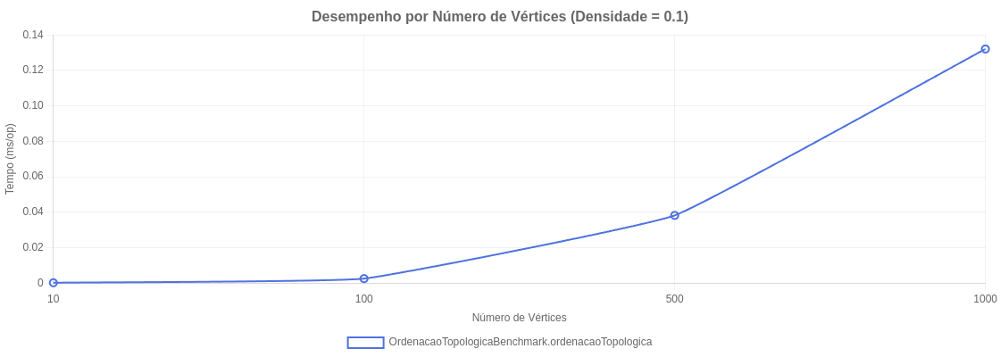
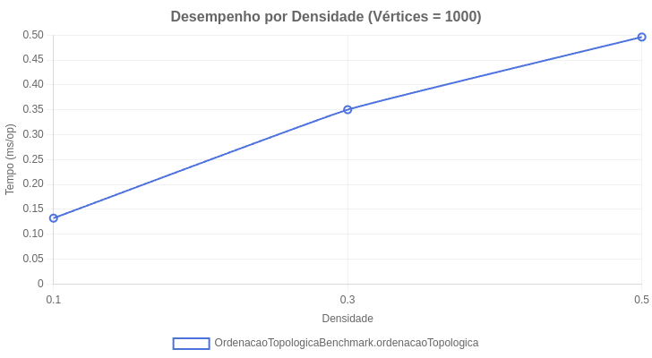

### **Ordenação Topológica**

#### **Contextualização**

Em teoria dos grafos, a ordenação topológica de um grafo acíclico direcionado (DAG Directed Acyclic Graph) é uma ordenação linear de seus vértices, tal que para toda aresta direcionada de um vértice `u` para um vértice `v`, `u` vem antes de `v` na ordenação. Um DAG é um tipo de grafo que possui arestas com direção e não contém ciclos, ou seja, não é possível partir de um vértice e retornar a ele seguindo as direções das arestas.

Essa estrutura é fundamental para modelar problemas que envolvem dependências e pré-requisitos. Por exemplo, ao compilar um projeto de software, alguns arquivos precisam ser processados antes de outros. Da mesma forma, em uma grade curricular, certas disciplinas devem ser cursadas antes de suas sequências. A ordenação topológica nos fornece uma sequência válida para executar essas tarefas.

#### **O Problema**

O desafio consiste em determinar uma sequência de execução para um conjunto de tarefas com interdependências, por exemplo, disciplinas com pré-requisitos (como em nosso curso) ou etapas de um projeto. É preciso encontrar uma ordem linear que respeite todas as dependências e, ao mesmo tempo, detectar se o sistema é impossível de ser resolvido por conter um ciclo (uma dependência circular, como A depender de B e B depender de A). A solução para este problema é a **ordenação topológica**, um algoritmo que estabelece uma sequência de execução válida e identifica a existência de ciclos, sendo a abordagem realizada com Busca em Profundidade (DFS) uma das mais eficazes para implementá-lo.

#### **O Algoritmo Passo a Passo**

A implementação do algoritmo requer o controle do estado de cada vértice durante a busca. Para isso, foram usadas três estruturas de dados auxiliares:

  * `visitado[]`: um array booleano para marcar os vértices que já foram visitados em algum momento.
  * `noCaminhoAtual[]`: um array booleano para rastrear os vértices que estão na pilha de recursão da busca atual (ajuda na detecção de ciclos).
  * `pilhaFinalizacao`: uma pilha que armazena os vértices na ordem em que eles são finalizados.

**1. Inicialização**

O método principal inicializa as estruturas de dados e percorre todos os vértices do grafo, iniciando uma DFS para cada vértice que ainda não foi visitado.

```java
public List<Integer> ordenar() {
    int n = grafo.getNumVertices();
    List<Integer> resultado = new ArrayList<>();
    Stack<Integer> pilhaFinalizacao = new Stack<>();
    boolean[] visitado = new boolean[n];
    boolean[] noCaminhoAtual = new boolean[n];

    for (int i = 0; i < n; i++) {
        if (!visitado[i]) {
            // Se dfsUtil retornar true, um ciclo foi encontrado.
            if (dfsUtil(i, visitado, noCaminhoAtual, pilhaFinalizacao)) {
                throw new IllegalArgumentException("O grafo contém ciclos e não pode ser ordenado topologicamente.");
            }
        }
    }
}
```

**2. O DFS Modificado e a Detecção de Ciclos**

A parte central deste algoritmo é a função recursiva `dfsUtil`. Para cada vértice `v` visitado, ela faz o seguinte:

1.  Marca `v` como `visitado` e como parte do `noCaminhoAtual`.
2.  Para cada vizinho de `v`, verifica:
      * Se o vizinho não foi visitado, chama a recursão para ele.
      * Se o vizinho já foi visitado E está `noCaminhoAtual`, significa que encontramos uma aresta de volta (*back edge*). Isso forma um ciclo, e o algoritmo para.
3.  Depois de visitar todos os vizinhos de `v` (ou seja, explorar todo o caminho a partir dele), `v` é removido de `noCaminhoAtual` e adicionado à `pilhaFinalizacao`.

```java
private boolean dfsUtil(int v, boolean[] visitado, boolean[] noCaminhoAtual, 
                        Stack<Integer> pilhaFinalizacao) {
    visitado[v] = true;
    noCaminhoAtual[v] = true;
    
    for (Integer adjacente : grafo.getAdjacentes(v)) {
        if (!visitado[adjacente]) {
            if (dfsUtil(adjacente, visitado, noCaminhoAtual, pilhaFinalizacao)) {
                return true; // Ciclo detectado e propagado pela recursão
            }
        }
        else if (noCaminhoAtual[adjacente]) {
            return true; // Ciclo detectado
        }
    }
    
    // Todos os descendentes de 'v' foram visitados. Agora 'v' está finalizado.
    noCaminhoAtual[v] = false;
    pilhaFinalizacao.push(v);
    return false; // Nenhum ciclo encontrado neste caminho
}
```

**3. Construção do Resultado Final**

Após o laço principal terminar (garantindo que todos os vértices foram visitados), a `pilhaFinalizacao` contém os vértices na ordem inversa da ordenação topológica. Basta desempilhá-los para uma lista para obter o resultado final.

```java
while (!pilhaFinalizacao.isEmpty()) {
    resultado.add(pilhaFinalizacao.pop());
}
return resultado;
```

#### **Análise de Complexidade**

Saber a eficiência do algoritmo é essencial, então abaixo destaco as suas grandes vantagens:

  * **Complexidade de Tempo: $O(V + E)$**
    O algoritmo DFS visita cada vértice (`V`) e cada aresta (`E`) exatamente uma vez em um grafo direcionado. Todas as outras operações (marcação em arrays, empilhar) são de tempo constante.

  * **Complexidade de Espaço: $O(V)$**
    O espaço é necessário para armazenar os arrays de controle (`visitado` e `noCaminhoAtual`), a pilha de finalização e a pilha de recursão do sistema, que no pior caso pode ter o tamanho de `V`.

#### **Benchmark de Desempenho**

A eficiência do algoritmo foi validada através de benchmarks utilizando a biblioteca JMH. Foram gerados grafos acíclicos direcionados (DAGs) de diferentes tamanhos (número de vértices) e densidades (proporção de arestas), e o tempo médio de execução foi medido em milissegundos por operação (ms/op).

##### **Resultados Experimentais**

Os benchmarks foram realizados com as seguintes configurações:
- **Número de vértices:** 10, 100, 500 e 1000
- **Densidades de grafo:** 0.1, 0.3 e 0.5
- **Métrica:** Tempo médio por operação (ms/op)

| Densidade | Vértices | Tempo (ms/op) |
|-----------|----------|---------------|
| 0.1       | 10       | 0.000108      |
| 0.1       | 100      | 0.002136      |
| 0.1       | 500      | 0.036018      |
| 0.1       | 1000     | 0.139974      |
| 0.3       | 10       | 0.000098      |
| 0.3       | 100      | 0.003716      |
| 0.3       | 500      | 0.085508      |
| 0.3       | 1000     | 0.352546      |
| 0.5       | 10       | 0.000128      |
| 0.5       | 100      | 0.004929      |
| 0.5       | 500      | 0.126963      |
| 0.5       | 1000     | 0.499249      |

##### **Análise do Crescimento com Número de Vértices**

Quando observamos o comportamento do algoritmo mantendo uma densidade constante (por exemplo, 0.1) e aumentando o número de vértices:
- De 10 para 100 vértices (10x): o tempo aumenta de 0.000108 para 0.002136 ms/op (~19.8x)
- De 100 para 500 vértices (5x): o tempo aumenta de 0.002136 para 0.036018 ms/op (~16.9x)
- De 500 para 1000 vértices (2x): o tempo aumenta de 0.036018 para 0.139974 ms/op (~3.9x)

Este crescimento não é perfeitamente linear, mas está próximo do esperado para um algoritmo de complexidade O(V + E), especialmente considerando que o número de arestas E também aumenta com o número de vértices V e a densidade fixa.

##### **Impacto da Densidade**

Observando os resultados para um número fixo de vértices (1000) com densidades crescentes:
- Densidade 0.1: 0.139974 ms/op
- Densidade 0.3: 0.352546 ms/op (~2.52x mais lento)
- Densidade 0.5: 0.499249 ms/op (~3.57x mais lento que 0.1)

O aumento da densidade tem um impacto significativo no desempenho, o que é esperado, já que mais arestas (E) significam mais trabalho para o algoritmo. Este comportamento confirma a complexidade O(V + E), onde E cresce com a densidade.

##### **Visualização Gráfica dos Resultados**

Os gráficos a seguir ilustram visualmente o comportamento do algoritmo de ordenação topológica sob diferentes condições:

**1. Desempenho por Número de Vértices (Densidade = 0.1)**

Este gráfico mostra como o tempo de execução aumenta à medida que o número de vértices cresce, mantendo a densidade constante em 0.1.



Como pode ser observado, o crescimento do tempo de execução acompanha o aumento do número de vértices de forma quase linear, confirmando a complexidade teórica O(V + E).

**2. Desempenho por Densidade (1000 Vértices)**

Este gráfico demonstra como o aumento da densidade do grafo afeta o tempo de execução para um grafo com 1000 vértices.



É possível observar que o aumento da densidade tem um impacto significativo no desempenho, pois um grafo mais denso significa mais arestas para processar.

##### **Verificação da Complexidade Teórica**

Para um grafo direcionado com V vértices e densidade d, o número esperado de arestas é aproximadamente E = d × V × (V-1). Ao aumentar V de 500 para 1000 com densidade 0.3:
- Para V=500: E ≈ 0.3 × 500 × 499 ≈ 74,850 arestas
- Para V=1000: E ≈ 0.3 × 1000 × 999 ≈ 299,700 arestas

O aumento de E é aproximadamente 4x, enquanto o aumento no tempo de execução foi de aproximadamente 4.12x (de 0.085508 para 0.352546 ms/op). Esta correspondência confirma que o algoritmo está se comportando conforme a complexidade teórica esperada O(V + E).

**OBS.:** Pode-se ainda consultar o arquivo HTML de análise dos benchmarks que é gerado (`toposort-resultados.html`).


#### **Aplicações**

A ordenação topológica é amplamente utilizada em problemas do mundo real, como:

  * **Gerenciamento de Projetos:** Determinar a ordem de execução de tarefas em um cronograma, onde algumas tarefas são pré-requisitos para outras.
  * **Compiladores:** Na compilação de código-fonte, a ordenação topológica define a ordem correta de compilação, já que muitas vezes os módulos ou arquivos dependem uns dos outros.
  * **Resolução de Dependências:** Em sistemas de gerenciamento de pacotes (como Maven, npm ou pip), a ordenação topológica é usada para determinar em que ordem os pacotes devem ser instalados para satisfazer todas as dependências.
  * **Grades Curriculares:** Montar uma sequência válida de disciplinas a serem cursadas, respeitando os pré-requisitos de cada uma. Como na nossa realidade do curso, para cursar LEDA, foi necessário ter sido aprovado, por exemplo, em LP2.

#### **Contribuições**

  * **Autora:** Joyce Vitória Nascimento Rodrigues

#### **Bibliografia**

1.  CORMEN, T. H.; LEISERSON, C. E.; RIVEST, R. L.; STEIN, C. **Introduction to Algorithms**. 3rd ed. MIT Press, 2009.
2.  FEOFILOFF, P.; KOHAYAKAWA, Y.; WAKABAYASHI, Y. **Uma Introdução Sucinta à Teoria dos Algoritmos**. Instituto de Matemática e Estatística da USP (IME-USP), 2011.
3.  TARJAN, R. E. (1972). **Depth-First Search and Linear Graph Algorithms**. SIAM Journal on Computing, 1(2), 146-160.