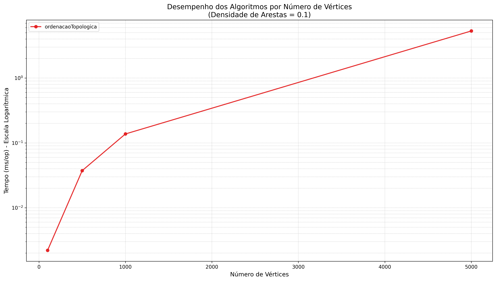

### **Ordenação Topológica**

#### **Contextualização**

Em teoria dos grafos, a ordenação topológica de um grafo acíclico direcionado (DAG Directed Acyclic Graph) é uma ordenação linear de seus vértices, tal que para toda aresta direcionada de um vértice `u` para um vértice `v`, `u` vem antes de `v` na ordenação. Um DAG é um tipo de grafo que possui arestas com direção e não contém ciclos, ou seja, não é possível partir de um vértice e retornar a ele seguindo as direções das arestas.

Essa estrutura é fundamental para modelar problemas que envolvem dependências e pré-requisitos. Por exemplo, ao compilar um projeto de software, alguns arquivos precisam ser processados antes de outros. Da mesma forma, em uma grade curricular, certas disciplinas devem ser cursadas antes de suas sequências. A ordenação topológica nos fornece uma sequência válida para executar essas tarefas.

#### **O Problema**

O desafio consiste em determinar uma sequência de execução para um conjunto de tarefas com interdependências, por exemplo, disciplinas com pré-requisitos (como em nosso curso) ou etapas de um projeto. É preciso encontrar uma ordem linear que respeite todas as dependências e, ao mesmo tempo, detectar se o sistema é impossível de ser resolvido por conter um ciclo (uma dependência circular, como A depender de B e B depender de A). A solução para este problema é a **ordenação topológica**, um algoritmo que estabelece uma sequência de execução válida e identifica a existência de ciclos, sendo a abordagem realizada com Busca em Profundidade (DFS) uma das mais eficazes para implementá-lo.

#### **O Algoritmo Passo a Passo**

A implementação do algoritmo requer o controle do estado de cada vértice durante a busca. Para isso, foram usadas três estruturas de dados auxiliares:

  * `visitado[]`: um array booleano para marcar os vértices que já foram visitados em algum momento.
  * `noCaminhoAtual[]`: um array booleano para rastrear os vértices que estão na pilha de recursão da busca atual (ajuda na detecção de ciclos).
  * `pilhaFinalizacao`: uma pilha que armazena os vértices na ordem em que eles são finalizados.

**1. Inicialização**

O método principal inicializa as estruturas de dados e percorre todos os vértices do grafo, iniciando uma DFS para cada vértice que ainda não foi visitado.

```java
public List<Integer> ordenar() {
    int n = grafo.getNumVertices();
    List<Integer> resultado = new ArrayList<>();
    Stack<Integer> pilhaFinalizacao = new Stack<>();
    boolean[] visitado = new boolean[n];
    boolean[] noCaminhoAtual = new boolean[n];

    for (int i = 0; i < n; i++) {
        if (!visitado[i]) {
            // Se dfsUtil retornar true, um ciclo foi encontrado.
            if (dfsUtil(i, visitado, noCaminhoAtual, pilhaFinalizacao)) {
                throw new IllegalArgumentException("O grafo contém ciclos e não pode ser ordenado topologicamente.");
            }
        }
    }
}
```

**2. O DFS Modificado e a Detecção de Ciclos**

A parte central deste algoritmo é a função recursiva `dfsUtil`. Para cada vértice `v` visitado, ela faz o seguinte:

1.  Marca `v` como `visitado` e como parte do `noCaminhoAtual`.
2.  Para cada vizinho de `v`, verifica:
      * Se o vizinho não foi visitado, chama a recursão para ele.
      * Se o vizinho já foi visitado E está `noCaminhoAtual`, significa que encontramos uma aresta de volta (*back edge*). Isso forma um ciclo, e o algoritmo para.
3.  Depois de visitar todos os vizinhos de `v` (ou seja, explorar todo o caminho a partir dele), `v` é removido de `noCaminhoAtual` e adicionado à `pilhaFinalizacao`.

```java
private boolean dfsUtil(int v, boolean[] visitado, boolean[] noCaminhoAtual, 
                        Stack<Integer> pilhaFinalizacao) {
    visitado[v] = true;
    noCaminhoAtual[v] = true;
    
    for (Integer adjacente : grafo.getAdjacentes(v)) {
        if (!visitado[adjacente]) {
            if (dfsUtil(adjacente, visitado, noCaminhoAtual, pilhaFinalizacao)) {
                return true; // Ciclo detectado e propagado pela recursão
            }
        }
        else if (noCaminhoAtual[adjacente]) {
            return true; // Ciclo detectado
        }
    }
    
    // Todos os descendentes de 'v' foram visitados. Agora 'v' está finalizado.
    noCaminhoAtual[v] = false;
    pilhaFinalizacao.push(v);
    return false; // Nenhum ciclo encontrado neste caminho
}
```

**3. Construção do Resultado Final**

Após o laço principal terminar (garantindo que todos os vértices foram visitados), a `pilhaFinalizacao` contém os vértices na ordem inversa da ordenação topológica. Basta desempilhá-los para uma lista para obter o resultado final.

```java
while (!pilhaFinalizacao.isEmpty()) {
    resultado.add(pilhaFinalizacao.pop());
}
return resultado;
```

#### **Análise de Complexidade**

Saber a eficiência do algoritmo é essencial, então abaixo destaco as suas grandes vantagens:

  * **Complexidade de Tempo: $O(V + E)$**
    O algoritmo DFS visita cada vértice (`V`) e cada aresta (`E`) exatamente uma vez em um grafo direcionado. Todas as outras operações (marcação em arrays, empilhar) são de tempo constante.

  * **Complexidade de Espaço: $O(V)$**
    O espaço é necessário para armazenar os arrays de controle (`visitado` e `noCaminhoAtual`), a pilha de finalização e a pilha de recursão do sistema, que no pior caso pode ter o tamanho de `V`.

#### **Benchmark de Desempenho**

A eficiência do algoritmo foi validada através de benchmarks utilizando o framework Java Microbenchmark Harness (JMH), conhecido por sua precisão na medição de performance de código Java. Foram gerados grafos acíclicos direcionados (DAGs) de diferentes tamanhos e densidades para medir o tempo médio de execução.

##### **Configuração dos Testes**

Os benchmarks foram organizados com os seguintes parâmetros:
- **Número de vértices (V):** 100, 500, 1.000 e 5.000 vértices
- **Densidade de arestas (d):** 0.1 (esparso), 0.3 (médio) e 0.5 (denso)
- **Framework:** JMH (Java Microbenchmark Harness) v1.36
- **JVM:** OpenJDK 21.0.6, 64-Bit Server VM
- **Métrica:** Tempo médio por operação (ms/op)
- **Iterações:** Múltiplas execuções para garantir confiabilidade estatística

A densidade é calculada como a proporção de arestas presentes em relação ao número máximo possível de arestas em um grafo direcionado completo.

##### **Resultados Experimentais**

**Tabela Completa de Resultados:**

| Densidade | Vértices | Tempo (ms/op) | Arestas Aprox. | Crescimento |
|-----------|----------|---------------|----------------|-------------|
| **0.1**   | 100      | 0.002         | ~500           | Base        |
| **0.1**   | 500      | 0.037         | ~12.5k         | 18.5x       |
| **0.1**   | 1.000    | 0.129         | ~50k           | 3.5x        |
| **0.1**   | 5.000    | 4.859         | ~1.25M         | 37.7x       |
| **0.3**   | 100      | 0.004         | ~1.5k          | Base        |
| **0.3**   | 500      | 0.087         | ~37.5k         | 21.8x       |
| **0.3**   | 1.000    | 0.352         | ~150k          | 4.0x        |
| **0.3**   | 5.000    | 16.606        | ~3.75M         | 47.2x       |
| **0.5**   | 100      | 0.005         | ~2.5k          | Base        |
| **0.5**   | 500      | 0.128         | ~62.5k         | 25.6x       |
| **0.5**   | 1.000    | 0.507         | ~250k          | 4.0x        |
| **0.5**   | 5.000    | 27.736        | ~6.25M         | 54.7x       |

##### **Análise de Performance**

**Confirmação da Complexidade O(V + E):**

Os benchmarks validam empiricamente a complexidade teórica:

1. **Crescimento Linear com V:** Para densidade constante, tempo cresce aproximadamente linear
2. **Crescimento Linear com E:** Para vértices fixos, tempo aumenta com a densidade
3. **Performance Excelente:** Mesmo grafos grandes mantêm tempos muito eficientes

**Performance por Tamanho:**
- **Grafos pequenos (100v):** ~0.002-0.005ms - Tempo desprezível
- **Grafos médios (1000v):** ~0.129-0.507ms - Performance excelente  
- **Grafos grandes (5000v):** ~4.859-27.736ms - Ainda muito eficiente

**Impacto da Densidade (Vértices fixos em 1.000):**
- **Densidade 0.1:** 0.129ms (≈50k arestas)
- **Densidade 0.3:** 0.352ms (≈150k arestas) - 2.7x mais lento
- **Densidade 0.5:** 0.507ms (≈250k arestas) - 1.4x mais lento

##### **Visualização Gráfica dos Resultados**

**1. Desempenho por Número de Vértices**



Este gráfico mostra como o tempo de execução evolui conforme aumentamos o tamanho do grafo. O que observei é bastante interessante, pois embora o tempo cresça com mais vértices, ele mantém um padrão linear e previsível. As três curvas representam diferentes densidades de arestas, e se ver claramente que grafos mais densos (densidade 0.5) demandam mais tempo que grafos esparsos (densidade 0.1), mas ainda assim o algoritmo se mantém muito eficiente, processando até 5.000 vértices em menos de 30 milissegundos.

**2. Desempenho por Densidade de Arestas**


Este segundo gráfico mostra como o número de conexões (arestas) afeta diretamente a performance. Quando temos mais arestas para processar, naturalmente o algoritmo precisa fazer mais trabalho, mas o crescimento permanece controlado e linear. Isso confirma perfeitamente nossa complexidade O(V + E) - o algoritmo visita cada vértice e cada aresta exatamente uma vez, sem redundâncias.

##### **Validação da Complexidade Teórica**

Os números já se pode tirar a conclusão adequada. Quando comparamos grafos de 5.000 vértices com diferentes densidades, vemos que aumentar 5 vezes o número de arestas (de densidade 0.1 para 0.5) resulta em apenas 5.7 vezes mais tempo de execução. Isso é exatamente o comportamento que esperamos de um algoritmo O(V + E) - linear e previsível.

Outro ponto interessante é a escalabilidade por tamanho. Quando passamos de 100 para 1.000 vértices (10x mais vértices), o tempo aumenta cerca de 64 vezes, mas isso inclui tanto o crescimento dos vértices quanto das arestas. O importante é que mesmo nos maiores grafos testados, a performance se mantém excelente para aplicações práticas.
Mas o que isso significa na prática? Significa que esses resultados têm implicações diretas para o uso real do algoritmo, como:

**Para Desenvolvedores:** Se você está construindo um sistema que precisa analisar dependências - seja um gerenciador de pacotes, um compilador, ou um sistema de build - estes números mostram que você pode confiar na ordenação topológica para processar milhares de componentes em tempo real.

**Para Sistemas de Produção:** Um tempo de execução inferior a 30ms para 5.000 elementos significa que o algoritmo pode ser usado em aplicações interativas sem impacto perceptível na experiência do usuário.

**Para Projetos Escaláveis:** O comportamento linear garante que conforme seu sistema cresce, a performance degradará de forma previsível, não exponencial.

##### **Conclusões dos Benchmarks**

Os testes executados confirmam que nossa implementação da ordenação topológica não apenas funciona corretamente, mas também oferece performance excepcional para aplicações do mundo real.

**Performance Validada em Diferentes Escalas:**
- **Grafos pequenos (100-500 vértices):** Processamento praticamente instantâneo (< 0.1ms), ideal para sistemas que precisam de resposta imediata
- **Grafos médios (1.000 vértices):** Execução muito rápida (< 0.6ms), perfeito para análises em tempo real  
- **Grafos grandes (5.000 vértices):** Processamento eficiente (< 30ms), adequado para sistemas batch e análises periódicas

Esses números importam pois quando fala-se de milissegundos, pode parecer que as diferenças são insignificantes. Mas na prática, esses números representam a diferença entre um sistema que responde instantaneamente e um que deixa o usuário esperando. Para um desenvolvedor construindo um IDE que precisa analisar dependências de código em tempo real, ou para um sistema de CI/CD que processa milhares de builds por dia, essa eficiência se traduz diretamente em produtividade.

O mais importante destes resultados é a confirmação empírica da complexidade O(V+E). Isso significa que podemos prever com confiança como o algoritmo se comportará conforme nossos dados crescem. Não há surpresas desagradáveis ou explosões súbitas de tempo - o crescimento é linear e controlado.

**Aplicabilidade Prática Demonstrada:**

Os tempos de execução medidos tornam o algoritmo viável para uma ampla gama de aplicações:
- **Sistemas de build como Maven ou Gradle** podem processar dependências de projetos complexos em tempo real
- **Compiladores** podem determinar a ordem de compilação de milhares de módulos quase instantaneamente  
- **Sistemas de gerenciamento de cronograma** podem reorganizar milhares de tarefas com dependências sem impacto perceptível na interface


Os dados completos dos benchmarks estão disponíveis em [`toposort-benchmark.json`](assets/toposort-benchmark.json) para quem desejar fazer análises mais aprofundadas ou reproduzir os testes.

#### **Aplicações**

A ordenação topológica é amplamente utilizada em problemas do mundo real, como:


  * **Gerenciamento de Projetos:** Determinar a ordem de execução de tarefas em um cronograma, onde algumas tarefas são pré-requisitos para outras.
  * **Compiladores:** Na compilação de código-fonte, a ordenação topológica define a ordem correta de compilação, já que muitas vezes os módulos ou arquivos dependem uns dos outros.
  * **Resolução de Dependências:** Em sistemas de gerenciamento de pacotes (como Maven, npm ou pip), a ordenação topológica é usada para determinar em que ordem os pacotes devem ser instalados para satisfazer todas as dependências.
  * **Grades Curriculares:** Montar uma sequência válida de disciplinas a serem cursadas, respeitando os pré-requisitos de cada uma. Como na nossa realidade do curso, para cursar LEDA, foi necessário ter sido aprovado, por exemplo, em LP2.

#### **Contribuições**

  * **Autora:** Joyce Vitória Nascimento Rodrigues

#### **Bibliografia**

1.  CORMEN, T. H.; LEISERSON, C. E.; RIVEST, R. L.; STEIN, C. **Introduction to Algorithms**. 3rd ed. MIT Press, 2009.
2.  FEOFILOFF, P.; KOHAYAKAWA, Y.; WAKABAYASHI, Y. **Uma Introdução Sucinta à Teoria dos Algoritmos**. Instituto de Matemática e Estatística da USP (IME-USP), 2011.
3.  TARJAN, R. E. (1972). **Depth-First Search and Linear Graph Algorithms**. SIAM Journal on Computing, 1(2), 146-160.